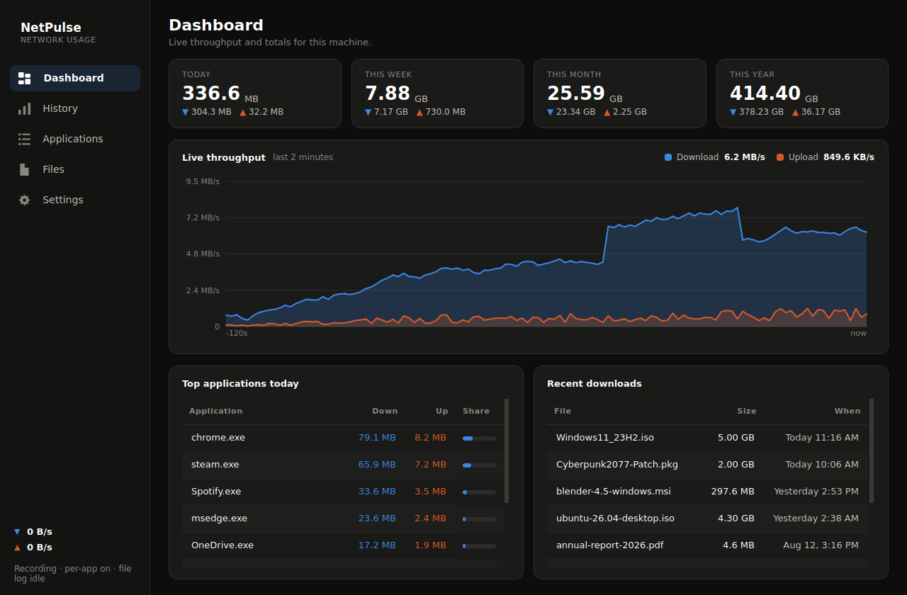
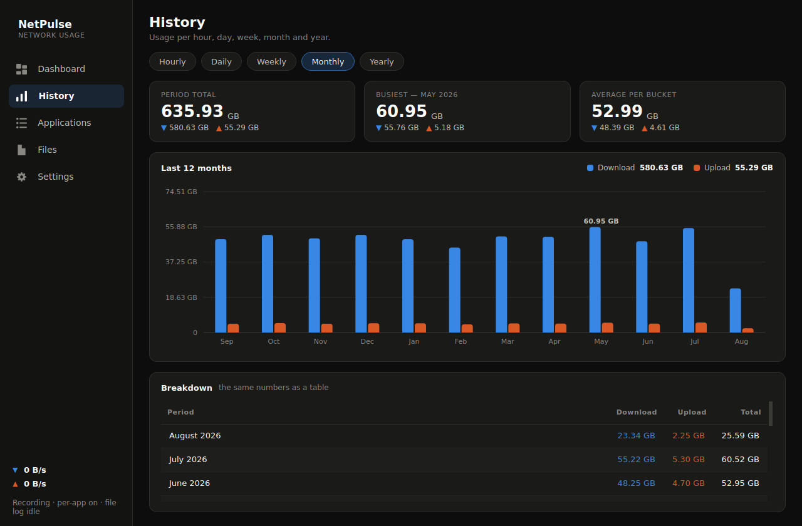
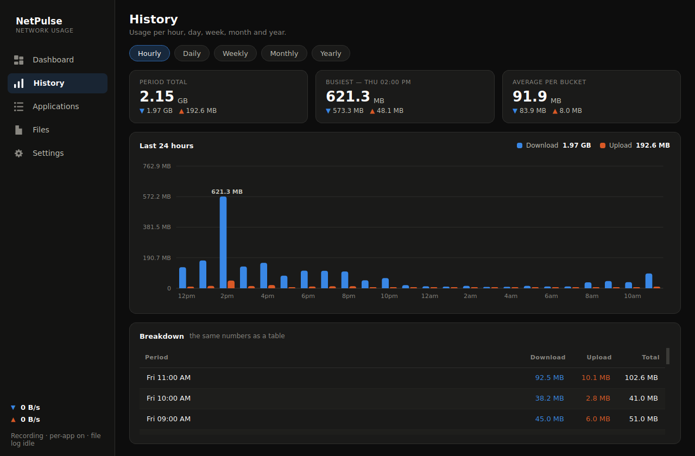
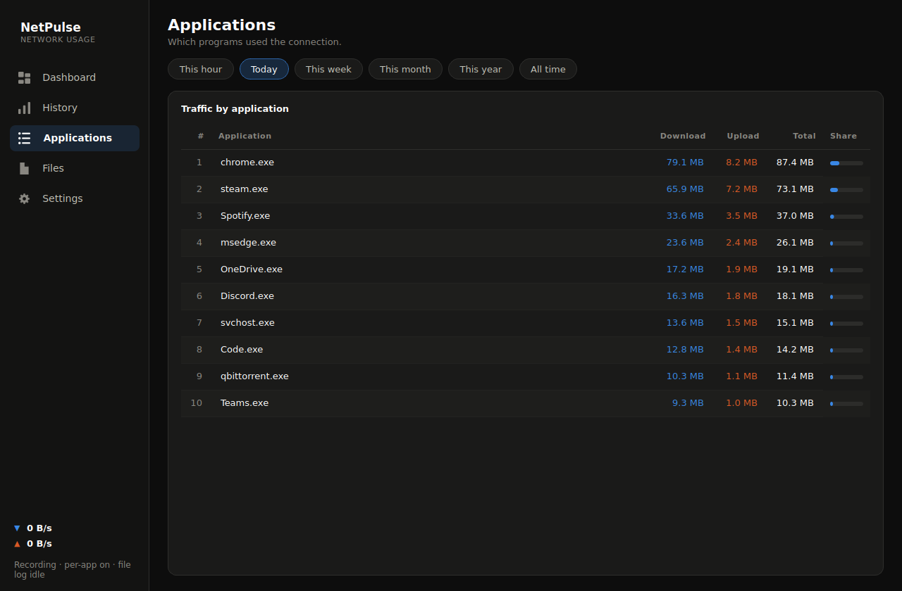
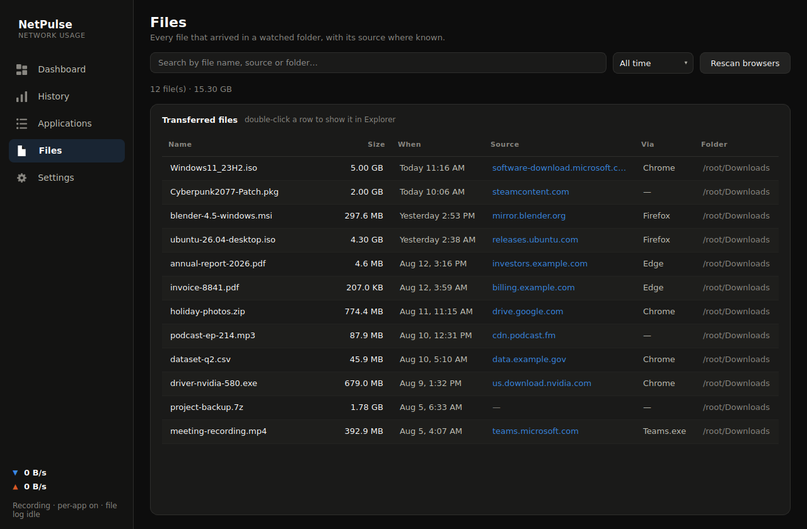
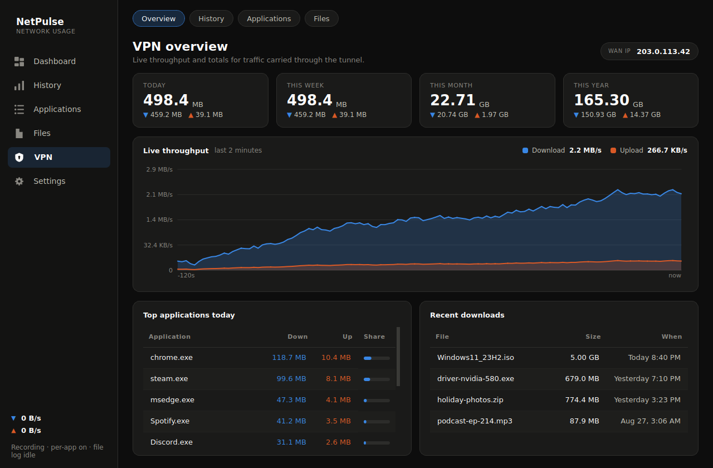
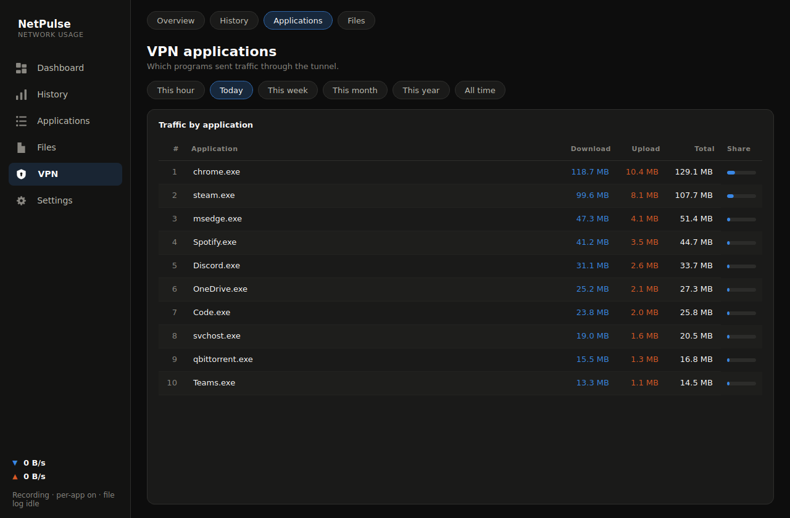

<h1 align="center">NetPulse</h1>

<p align="center">
  A network usage monitor for Windows.<br>
  How much you upload and download — per hour, day, week, month and year —
  broken down by application, with a log of the files that arrive on your machine.
</p>

<p align="center">
  <a href="https://github.com/YOUR-USERNAME/netpulse/actions/workflows/tests.yml">
    </a>
  
  
  <a href="LICENSE"></a>
</p>



---

## What it does

- **Totals for every period you'd want** — this hour, today, this week, this
  month, this year, all time. Hourly, daily, weekly, monthly and yearly charts,
  each hoverable, each also rendered as a plain table.
- **Per-application breakdown** — which programs actually used the connection,
  ranked, for any period.
- **A file log** — every file that lands in your watched folders, with its size,
  when it arrived, and where it came from.
- **Live throughput** — a two-minute rolling graph, plus a tray icon whose
  arrows brighten with activity.
- **A separate VPN tab** — the same overview, history, applications and files,
  restricted to what actually went through the tunnel. The main pages then show
  direct traffic only, so the two are never added together.
- **Your public IP** — shown beside the dashboard title, click to copy. Follows
  a VPN within seconds of it connecting or dropping.
- **Local and private** — one SQLite file in `%APPDATA%\NetPulse`. No account,
  no cloud, no telemetry. The *only* outbound request it ever makes is the
  public-IP lookup, and that can be switched off in Settings.

## Screenshots

<details>
<summary>History, Applications and Files</summary>

**History** — five bucketings of the same data, with the numbers repeated as a
table underneath.




**Applications** — which programs used the connection.



**Files** — what arrived, how big, and from where.



**VPN** — the same four views, tunnelled traffic only.




</details>

## Download

**[Grab the latest `NetPulse.exe` from Releases](../../releases/latest)** — one
file, no Python required. Put it anywhere and run it; for the per-application
breakdown, right-click and **Run as administrator**.

Windows SmartScreen will warn the first time because the file isn't
code-signed (signing certificates cost money). **More info → Run anyway**. Each
release lists the executable's SHA-256 if you want to verify it, and it's built
in the open by [this workflow](.github/workflows/release.yml) from the tagged
source — nothing is uploaded from a personal machine.

Prefer to run from source? Read on.

## Install from source

Requires **Windows 10 or 11** and **Python 3.10+**.

1. Download or clone this repository.
2. Double-click **`install.bat`**. It locates Python for you — the `py`
   launcher, your `PATH`, the registry, the usual python.org locations, and
   Anaconda / Miniconda — then installs the dependencies.
   If it finds no suitable Python it offers to install one via winget.
3. Start it:
   - **`run.bat`** — normal start.
   - **`run-as-admin.bat`** — start elevated, which additionally enables the
     per-application breakdown.

Optionally run **`make-shortcut.bat`** for a Desktop shortcut carrying the app's
own icon, which you can drag to the taskbar to pin.

The interpreter that ends up being used is cached in `python-path.txt`. To point
NetPulse at a different Python, edit that file — one line, the full path to
`python.exe`.

## How it measures

Three independent sources, and it's worth knowing which number comes from where.

### Totals — adapter counters

Machine-wide upload and download come from the byte counters Windows keeps per
network adapter, the same source Task Manager uses. Exact, never misses traffic,
needs no special permissions. Virtual adapters (Hyper-V, WSL, VMware,
VirtualBox, loopback) are excluded so nothing is counted twice.

### Direct and tunnelled traffic

A VPN adapter and the physical adapter beneath it both count the same
conversation — once as plaintext entering the tunnel, once as ciphertext on the
wire. Adding them together doubles every figure while a VPN is connected, which
is exactly what earlier versions did.

So the two are measured apart. The tunnel adapter's own counters are the VPN
figure, exact as any other adapter reading. **Direct** is what remains of the
physical adapter once the tunnel's share is subtracted — the traffic that
genuinely bypassed the VPN, plus a few percent of encryption overhead, which is
real traffic on the wire and has to live somewhere.

Every row in the database carries which side it belongs to, so the VPN tab and
the main pages are two views of one store rather than two stores that can drift.
Files are tagged the same way, by whether the tunnel was up when they arrived.

### Per-application — kernel network trace

Windows exposes no ordinary API for per-process byte counts. NetPulse reads what
Task Manager's own network column reads: the `Microsoft-Windows-Kernel-Network`
ETW provider, which emits an event for every TCP/UDP send and receive along with
the owning process ID.

Opening a real-time kernel trace requires administrator rights, so this is the
one feature that needs the elevated start. Without it everything else still
works and the Applications page says so. Traffic to `127.0.0.1` is excluded, so
local dev servers don't inflate the numbers.

### Files — watched folders + browser history

Two sources that reinforce each other:

- **Folder watching** sees every file that lands in Downloads, Desktop,
  Documents, Pictures, Videos and Music — whatever put it there: a browser, a
  torrent client, Steam, an installer, a copy from a network share. A file is
  only logged once its size stops changing, so half-finished `.crdownload` and
  `.part` files never appear.
- **Browser download history** (Chrome, Edge, Brave, Opera, Vivaldi, Firefox —
  all profiles) supplies what folder watching can't know: the **source URL**.
  Records are matched back by path, and downloads that landed outside a watched
  folder are added from here too.

### Public IP — an outside lookup

Your router knows its WAN address but there is no vendor-neutral way to ask it,
so NetPulse does what every other tool does: asks an external service what
address the request appeared to come from. It tries ipify.org and a few
alternatives in turn.

Rather than poll frequently, it watches your **local network adapters**, which
costs nothing and changes the moment a VPN connects or drops. When that
happens the address is re-checked within a couple of seconds — and again a few
times after, because a VPN adapter appears before its routes are ready, so the
first answer can still be the old address. A slow periodic check every 15
minutes remains as a backstop for changes with no local cause, such as an ISP
lease renewal.

Six providers are tried in turn, and whichever answered last is tried first
next time — ad-blocking DNS, router filters and VPN "clean browsing" options
block some of these by name, and remembering a working one avoids walking the
list on every check. While attempts are still in progress the chip reads
*retrying…* rather than *unavailable*, because those mean different things.

The last provider in the list is the one that matters when the others are
blocked: it is reached at `https://1.1.1.1/...`, an address rather than a name,
so it needs no DNS at all. Filtered name resolution takes out every other
provider at once — and it tends to do so precisely when a VPN has just
connected, which is the moment the address is most worth knowing. Cloudflare's
certificate covers the address itself, so TLS still validates with no hostname
involved.

That is a small outbound request from an application built to watch outbound
requests, so it is worth stating plainly: it sends nothing but the request
itself, the response is validated as an address before being displayed, and the
whole feature has an off switch in Settings.

## What it deliberately doesn't do

**Track individual file uploads.** Seeing a photo posted to a website or an
attachment sent through webmail would mean decrypting your HTTPS traffic through
a local proxy — installing a root certificate, breaking every app that pins its
certificate, and getting flagged by antivirus. It would also still miss anything
that bypasses the system proxy. NetPulse doesn't go there. What it gives you
instead is upload **volume** per application and per period, which answers "what
has been uploading?" without touching encrypted traffic.

## Starting with Windows

Off by default; turn it on in **Settings → Appearance and behaviour**. The line
under the tick box always says which of two mechanisms is in use:

- **Scheduled task** — what it aims for. Windows starts NetPulse elevated and
  silently at sign-in, so per-application tracking works from the start.
  Registering the task is itself a privileged operation, so ticking the box
  raises one administrator prompt; you do not need to restart NetPulse as
  administrator first. It lives in Task Scheduler and, importantly, **does not
  appear in Task Manager's Startup tab**.
- **Startup entry** — the fallback if that prompt is declined or the task
  cannot be created. Windows always launches `Run` entries unelevated and
  cannot show a UAC prompt at sign-in, so per-application tracking will be off.
  Untick and re-tick the box to try for the scheduled task again.

The task records an absolute path. If you move or re-clone NetPulse, the old
task keeps starting the old copy — the line under the tick box says so when
that happens, and re-ticking repoints it.

## Storage and retention

Detail is thinned as it ages, so the database stays small however long it runs:

| Granularity | Kept for | Feeds |
|---|---|---|
| Per minute | 7 days | short-term detail |
| Per hour | 90 days | the hourly and daily views |
| Per day | forever | the weekly, monthly and yearly views |

Both windows are adjustable in Settings; daily totals are never deleted. Expect
a few megabytes per year. Rollups are recomputed rather than accumulated, so an
abrupt shutdown can never double-count. Buckets align to **local** midnight and
local hour boundaries, so "per day" means what your clock says, across DST
changes included.

## Development

```bash
python -m pip install -r requirements.txt
python -m unittest discover -s tests -v   # 118 tests
python -m pyflakes netpulse main.py tools tests
```

Two extra harnesses, both used by CI:

```bash
python tools/screenshot.py out/     # render every page offscreen, with demo data
python tools/smoketest.py           # run the real engine against real traffic
```

`tools/screenshot.py` is how the images above are produced — it seeds a database
with a year of plausible traffic and grabs each page with the offscreen Qt
platform, so the interface can be reviewed without a desktop session.

To build the standalone executable yourself, run **`build-exe.bat`** (or
`pyinstaller netpulse.spec`). The result is `dist\NetPulse.exe`. The same spec
file is what the release workflow uses, so a local build and a published one are
identical.

<details>
<summary>Layout</summary>

```
main.py                     entry point, single-instance guard
install.bat                 finds Python, installs dependencies
run.bat / run-as-admin.bat  launchers
make-shortcut.bat / .ps1    Desktop shortcut with the app icon
_find-python.bat            shared interpreter discovery
netpulse/
  config.py                 paths and persisted settings
  units.py                  byte / rate / time formatting
  db.py                     SQLite schema, rollups, retention, queries
  engine.py                 background collection loop
  autostart.py              scheduled task / Run key, elevated relaunch
  collectors/
    net_system.py           adapter counter sampling
    net_etw.py              per-process attribution via ETW
    files.py                folder watching + browser history
  ui/
    theme.py                colour roles and stylesheet
    assets.py               generated icons and control artwork
    widgets.py              cards, stat tiles, both charts
    pages.py                the pages, including the VPN tab
    main_window.py          sidebar navigation and refresh clock
    tray.py                 notification-area icon and app icon
tests/                      storage, link-split, autostart and icon tests
tools/                      screenshot and smoke-test harnesses
```

</details>

The charts are painted directly with `QPainter` rather than pulled from a
plotting library, which keeps the dependency list to three packages and gives
exact control over the marks. The colours are a categorical palette validated
for colour-vision deficiency against the dark surface.

## Troubleshooting

**"No Python 3.10 or newer was found."** Run `py -0p` in a Command Prompt to
list every interpreter the launcher knows about, then paste the full path into
`python-path.txt` and run `install.bat` again. Anaconda is fine — it just keeps
itself off the system `PATH`, which is the usual reason `python` "isn't found"
on a machine that clearly has it.

**"pywintrace is not installed."** `pip install pywintrace` — the current
release is 0.2.0, don't pin higher. It's optional; only the per-application
breakdown needs it.

**"Could not start the ETW session."** A previous session is still registered.
Run `logman stop NetPulseKernelNet -ets` in an elevated Command Prompt and
restart.

**Numbers look higher than my ISP reports.** Adapter counters include protocol
overhead and local network traffic — copying from a NAS, casting to a TV. ISPs
count only what crosses their border.

**A VPN is running and totals look doubled.** They shouldn't from 1.1.0 onward —
tunnel adapters are recognised by name and subtracted rather than added. If
yours isn't recognised, add it to `TUNNEL_HINTS` in
`netpulse/collectors/net_system.py`; the Settings page lists every adapter and
how it is being treated. Figures recorded before 1.1.0 were doubled while a VPN
was connected — **Settings → Reset all statistics** clears them.

**The WAN IP chip is stuck on "retrying…".** Up to 1.1.1 that could mean the
lookup thread had died: it had no exception guard, so a single unexpected error
ended it for the session while the interface went on promising an attempt that
was never coming. From 1.1.2 the loop survives any error, records it, and keeps
going — and if it ever does stop, the chip reads **stopped** and its tooltip
names the error. Run `python tools\diagnose-wanip.py 120` to watch the resolver
work and toggle a VPN while it does.

**I ticked "start when I sign in" but it's not in Task Manager's Startup tab.**
Expected if it registered as a scheduled task — check `taskschd.msc` instead.

## Licence

MIT — see [LICENSE](LICENSE).
